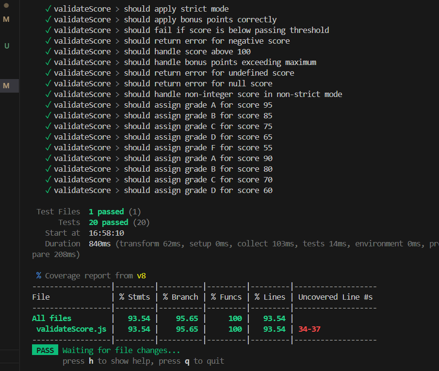
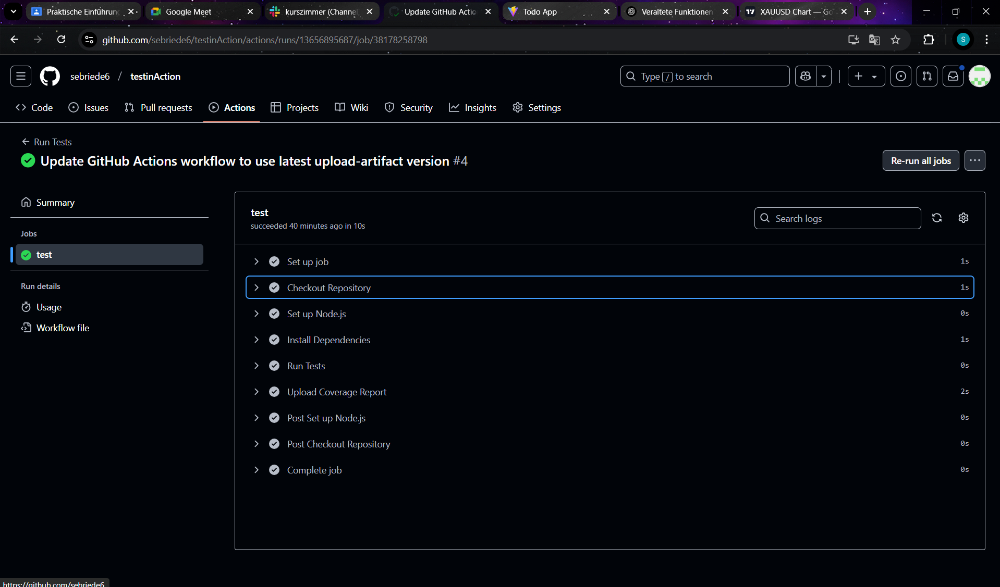
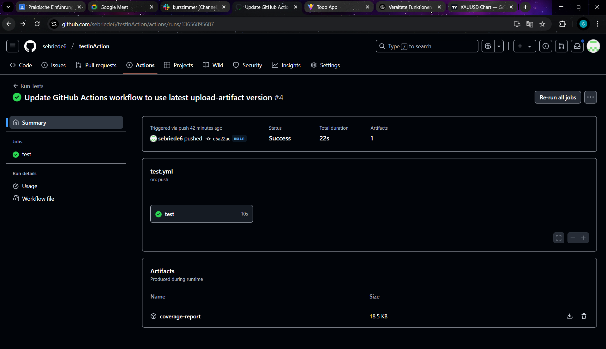

# Testprozess Dokumentation

## Test Coverage Report

## Gefundene Fehler und Edge-Cases
1. Ungültige Datentypen für `score`
   - Der `score` sollte eine Zahl sein. Wenn ein ungültiger Datentyp wie ein String übergeben wird, sollte die Funktion einen Fehler zurückgeben.
   - Beispiel: `validateScore("abc")` sollte `valid: false` und `errors: ["Score muss eine Zahl sein"]` zurückgeben.

2. Strikter Modus für nicht-ganzzahlige Werte
   - Im strikten Modus sollte der `score` eine ganze Zahl sein. Wenn eine nicht-ganzzahlige Zahl übergeben wird, sollte die Funktion einen Fehler zurückgeben.
   - Beispiel: `validateScore(75.5, { strictMode: true })` sollte `valid: false` und `errors: ["Score muss eine ganze Zahl sein"]` zurückgeben.

3. Bonuspunkte überschreiten das Maximum von 10 Punkten
   - Wenn Bonuspunkte hinzugefügt werden, sollte die Gesamtpunktzahl nicht mehr als 10 Bonuspunkte überschreiten. Die Funktion sollte sicherstellen, dass die maximale Punktzahl 100 nicht überschreitet.
   - Beispiel: `validateScore(95, { bonusCategories: ["math", "science", "art"] })` sollte `score: 100` und `grade: "A"` zurückgeben, da die maximale Punktzahl auf 100 begrenzt ist.

## Teststruktur
Die Tests sind in einem `describe` Block organisiert, der die Funktion `validateScore` beschreibt. Jeder Testfall wird mit `it` definiert und testet ein spezifisches Verhalten oder einen Edge-Case der Funktion. Die Tests decken verschiedene Szenarien ab, einschließlich:

- Validierung korrekter und inkorrekter `score` Werte.
- Anwendung des strikten Modus für ganzzahlige Werte.
- Berechnung von Bonuspunkten und Sicherstellung, dass die maximale Punktzahl 100 nicht überschreitet.
- Zuweisung von Noten basierend auf dem finalen Score.
- Behandlung von Randfällen wie negativen Werten, Werten über 100, undefined und null Werten.

## Reflexion zum TDD-Ansatz
TDD (Test-Driven Development) hilft, robusten und fehlerfreien Code zu schreiben, indem es die Entwicklung durch Tests vorantreibt. Der Hauptvorteil von TDD ist, dass es sicherstellt, dass der Code von Anfang an getestet wird, was zu weniger Fehlern und höherer Codequalität führt. Es fördert auch eine bessere Code-Architektur und Design, da wir gezwungen sind, über die Anforderungen und das Verhalten des Codes nachzudenken, bevor er ihn implementiert.

Ein Nachteil von TDD ist, dass es mehr initialen Aufwand erfordert, da Tests vor der Implementierung geschrieben werden müssen. Dies kann die Entwicklungszeit verlängern, insbesondere wenn die Anforderungen unklar sind oder sich häufig ändern. Außerdem kann es schwierig sein, TDD in bestehende Projekte zu integrieren, die nicht von Anfang an mit Tests entwickelt wurden.

## Screenshot der erfolgreichen GitHub Action
, 